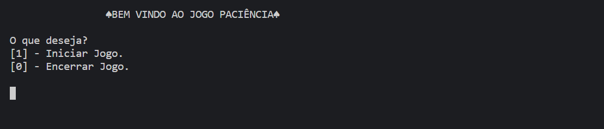
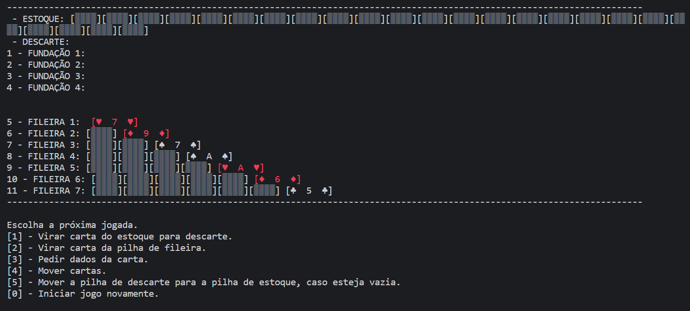
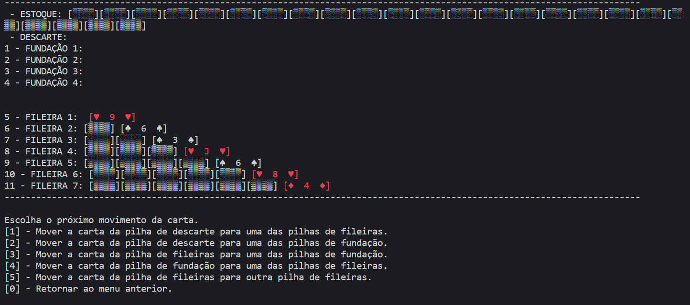
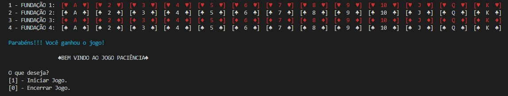

# **Como Jogar**

O jogo se inicia com o menu principal e duas opções: opção 1 para iniciar o jogo *paciência* e opção 2 para encerrar o programa.

Após escolhido a opção 1. É exibida a mesa do jogo, monte de estoque, descarte, fundações e fileiras, e é dado ao jogador 6 opções: 

* **Opção 1** - **Virar carta do estoque para descarte**: o jogador escolhe se deseja virar 1 ou 3 cartas do monte de estoque que são, automaticamente, movidas para o monte de descarte.

* **Opção 2** - **Virar carta da pilha de fileira**: quando a ultima carta da fileira está virada para baixo, o jogador irá pedir ao programa que ela vire para cima.

* **Opção 3** - **Pedir dados da carta**: o usuário pode pedir para exibir alguma carta da fileira ou fundação.

* **Opção 4** - **Mover cartas**: o usuário vai para o menu de movimentar as cartas para realizar ações no jogo.

* **Opção 5** - **Mover a pilha de descarte para a pilha de estoque, caso esteja vazia**: caso o monte de estoque já esteja vazia, todas as cartas no descarte, o jogador pode escolher que todas retornem para o descarte.

* **Opção 0** - **Iniciar jogo novamente**: o jogador retorna para o menu anterior para que possa ser reiniciado o jogo. 

Escolhendo a *opção 4* o jogador é direcionado para o menu que ele pode escolher qual movimento ele deseja realizar:

* **Opção 1** - **Mover a carta da pilha de descarte para uma das pilhas de fileiras**: selecionando essa opção a última carta do monte do descarte será movida para uma fileira escolhida pelo usuário.

* **Opção 2** - **Mover a carta da pilha de descarte para uma das pilhas de fundação**: selecionando essa opção a última carta do monte do descarte será movida para uma fundação escolhida pelo usuário.

* **Opção 3** - **Mover a carta da pilha de fileiras para uma das pilhas de fundação**: com essa opção a última carta de uma fileira, escolhida pelo usuário, será movida para uma fundação escolhida pelo mesmo.

* **Opção 4** - **Mover a carta da pilha de fundação para uma das pilhas de fileiras**: essa opção faz com que a última carta de uma fundação, escolhida pelo usuário, seja movida para uma fileira escolhida.

* **Opção 5** - **Mover a carta da pilha de fileiras para outra pilha de fileiras**: essa opção faz com que uma ou mais cartas sejam movidas entre as fileiras escolhidas pelo usuário.

* **Opção 0** - **Retornar ao menu anterior**: retona ao menu anterior, caso não deseje realizar nenhum movimento.

Após o jogador ter finalizado o jogo, esgotado as cartas do estoque, descarte e fileiras e completado todas as fundações do jogo ele é parabenizado e automaticamente levado para o menu inicial do jogo para escolher se quer encerrar o jogo ou começar uma nova partida.

